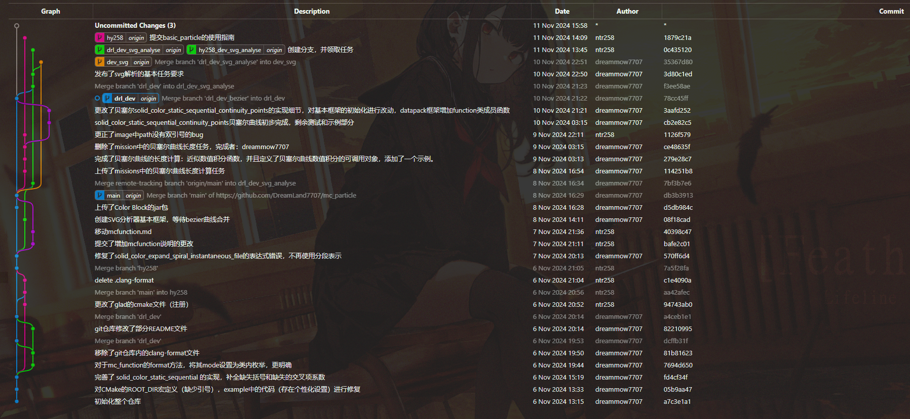

## git图具体解释

我们就以当前git图为例解释这个问题

在这个git图中，我们可以发现如下：

* 每一个branch的相互关系

+ 每一个branch的名字以及它们当前的状态
+ 每一次提交的具体描述
+ 每一次提交的时间和作者
+ 每一次提交的哈希值：commit栏

下面我们重点讲一下最左侧的图的含义

我们可以发现的是每一个branch似乎都有一个特定的颜色，并且每个颜色之间区别度都很大，这是否意味着一个颜色就对应一个branch呢？

**其实并不是！**

我们仔细观察可以发现，`main`分支是蓝的，而`drl_dev`也是蓝的

这是怎么一回事呢？

我们首先说出结论：**之所以会出现不同颜色的线条，是因为在一栏commit中会同时出现多个线条，所以才会出现不同颜色，颜色不是用来区别分支的。**

那么每一个线条的具体意义是什么呢？

**每一个线条的具体意义代表着发展的历史和方向。虽然在某种意义上它确实可以指示分支，但是实际上指示的效果仅能从当前状态指示到最近一次合并（到别的分支）**

我们知道每当你commit一次，git内就会有一个文件的改动，所commit的分支上就会多出一个commit节点（也就是图中的点），每一个节点代表着对于文件有改动，改动的描述就是commit时的陈述

而对于分支来讲，我们重点关注的不应该是这个**分支和谁合并过**或者**合并到谁**，这对于文件的改动的追踪是非常复杂的，每出现一种这样情况，你所需要记住的分支点就会越来越多

我们只需要寻找对于**每一个节点**，它的父节点是什么->它会继承它父节点的所有改变，而这个节点自从合并到某个分支后之前的提交历史就不再区分分支，合并后，无论是合并的分支还是被合并分支都可以通过reset到达之前任意一个节点。

请注意，在合并后分支的区分已经不再有意义，有意义的是提交节点：分支在合并后，之前的分支概念不再区分。

例如：在本例中`hy258`分支在`db3b3913`之前一定是存在的，但是我们是否知道在本合并提交之前此分支是哪个呢？经历了什么提交呢？我们无法准确区分，因为自从合并后，之前的所有提交就不再区分分支，hy258分支可以通过reset任意跳转到任意一个节点。

所以我们在本图中最重要的是观察**这个分支直到当前最新状态之前经历过什么提交（改变）**

我们观察每一个节点的父节点，也就是**在它下面的，并且有一条线连接着它的节点**

有的节点有1个父节点，有的有2个甚至更多

只有1个父节点的，我们可以确定这个**节点的父节点**一定是**本分支处于*过*的状态**

而有两个甚至更多的节点，我们称此节点为“merge”节点，也就是本节点是merge操作造成的，那么根据上文，再去通过它追溯分支状态就是没有意义的了，这也是为什么我说**指示的效果仅能从当前状态指示到最近一次合并（到别的分支）**

而我们观察整张图，不仅需要注意的是**本分支和别的分支的差异是什么**，也有**本分支曾有过什么改变**，前者需要仔细观察分支表，而后者只需要不断追溯父节点即可。

那么有上面这些话，是否可以回答这样一个问题：

提交`78cc45ff`和`f3ee58ae`这两个提交给drl_dev_svg_analyse带来了什么改变呢？它们存在的意义是什么？
总体而言是为了引入贝塞尔曲线。
之所以要合并两次，这里是为了让主干和支线同时引入这个功能。
同时，通过主干的merge可以避免无关的程序的冲突
（提示：drl_dev_svg_analyse需要贝塞尔曲线才可以正常开发）

